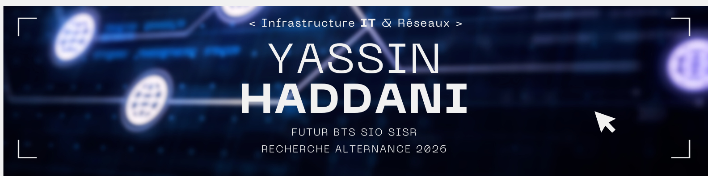

# 👋 Salut, moi c'est Yassin

🎓 Futur BTS SIO SISR  
💻 Passionné par les Réseaux & Systèmes  
📍 Lyon, France  
🚀 Recherche alternance 2026  

---

## 📬 Me contacter

)

---

## 🛠 Compétences

---

## 🚀 Projets principaux

- 🔐 Projet Linux SSH
- 🌐 Projet VLAN Bac Pro
- 🖥️ Projet Active Directory
- 🛜 Projet DHCP & DNS
- 🔒 Projet Firewall / Sécurité réseau
- 🐧 Installation serveur Linux
- 📦 Virtualisation avec VirtualBox
- 🧪 Lab réseau Cisco Packet Tracer

---

## 🎯 Objectif

Devenir Administrateur Systèmes & Réseaux et évoluer vers l’ingénierie réseau.
